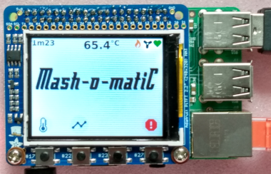

# Mash-o-matiC

[Messages](doc/messages.md) 
[GUI Modes & States](doc/gui_modes.md) 
[Cross Compiling For RPi](doc/rpi_setup.md) 
[Temperature Profile File Format](doc/file_format.md) 
[Todo List](doc/todo.md) 
[Project History](doc/history.md). 

A heating controller for homebrew beer [mashing](https://en.wikipedia.org/wiki/Mashing).

This repo is a collection of software that will run on an RPi with an [Adafruit 2315](https://www.adafruit.com/product/2315) - a 2.2" TFT screen with four push buttons (as shown in the photo). Originally it was going to be a touch screen, but push buttons will be more reliable with wet hands. 

The software is in three parts:
* A core application written in Python3, doing GPIO and maintaining the chosen temperature profile.
* A GUI written in C++/Qt using QtQuick so the actual GUI code is written in QML (effectively Javascript). In reality there is hardly any C++.
* GnuPlot to make nice temperature graphs as we go. It is quicker and easier to use this than spend ages hand crafting graphing code.

The hardware is:
* An RPi, small screen and push buttons
* A coil of copper pipe that is immersed in the mash tun
* A heating element and pump, in a loop connected to the coil
* Temperature sensor(s) in the mash tun
* Electronics allowing the heater and pump to be controlled by RPi GPIO.

How it works:
* The user will choose either a set fixed temperature to maintain, or a temperature profile (different temereratures at different times). 
* The core will read temperature from a number of sensors and decide whether to turn on the heater and pump, according to a pre-set temperature profile (e.g. maintain 66'C for mashing).
* As time passes the core will record actual temperature and target temperature in a log file
* Periodically the core will invoke GnuPlot to turn the temperature log into a graph and send it to the GUI code to display

The demands on the Pi are low, so eventually this could be deployed on the lowest spec Pi possible.

## Design

### Messaging
I decided that to keep the GUI simple and allow it to be developed in isolation, it will send and receive [messages](doc/messages.md) on stdin and stdout. In the final system it will communicate with the Python core over pipes. This has the benefit of being able to test the GUI by itself from the command line.

### TestStub

To test the GUI code, I wrote a simple test app that can be connected to GUI through pipes.
It can inject all types of message, and echoes anything sent back. This makes it far easier to develop the GUI than running it up on the RPi target system.

To test the gui:

    mkfifo f1 f2
    TestStub >f1 <f2
    # in a second terminal, or from QtCreator:
    gui <f1 >f2

### GUI Modes
Early ideas included a completely dumb GUI with the Python code telling it which buttons to show, and receiving each button press. This would mean the Python core would have to contain the basic UI logic as well as the "real" core of the project: the temperature control. 

The system has a GUI that knows what its doing and communicates with the core at a higher level. The GUI moves through a number of [states](doc/gui_modes.md).

### Temperature Profiles

Each temperature profile is [stored in a file](doc/file_format.md) somewhere on the Pi. How they get there is TBD, but probably by FTP or SCP. Generating them in the GUI will not be trivial.

The Python core will send a list of profile names and details to the GUI when the user wants to choose one. The GUI then sends back the `run` message with the chosen profile name.

## Tools

This is a classic cross-compiled embedded system. The details of setting up the cross-compiler warrant their own page:
[cross compiling for RPi](doc/rpi_setup.md)

### Host
* Developed on a Linux PC
* Qt 5.15.2
* QtCreator 4.14.0
* Python 3

### Target
* RPi Model 3 B
* Adafruit 2315 - a 2.2" TFT screen with four push buttons.
* Install [Pi TFT Hat drivers](https://learn.adafruit.com/adafruit-2-2-pitft-hat-320-240-primary-display-for-raspberry-pi/easy-install)
* No keyboard, mouse, or monitor
* Ethernet during development
* Might enable WiFi so we can update the software, and download new temperature profiles

## Visual Aspects

### Icons

UI icons are taken from here, where possible. https://material.io/tools/icons/?style=baseline

### Splash screen fonts

Some possible fonts to use for the "product" logo:

* https://www.fontspace.com/compaq-1982-font-f42638
* https://www.fontspace.com/rocket-script-font-f1092
* https://www.fontspace.com/fontdinerdotcom-jazz-font-f4891
* https://www.fontspace.com/flyboy-bb-font-f6939

In the end I went for Flyboy-BB.

