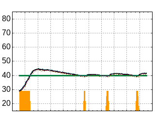
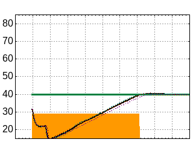
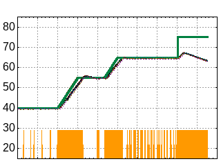

# Test Results

## Initial tests

### In air
Water in the loop, but the loop in air, not damped by a large mass of water.

Undamped, the temperature overshoots due to the slow response of the temperature sensors. This is to be expected and not a problem

### In water
In 10l of water

At this point the code is saying `cold`, and heating, when,  `t <= target - 0.5` and saying `hot` when `t > target + 0.5`.
The graph isn't detailed enough to see, but it hovers around t - 0.5.

## Temperature values

4 temperature sensors, 1 near the top, 1 near the bottom, and 2 just dangling:

Stirred water to ensure even temperature:
* Black electronic thermometer (0.5&deg; accuracy?) 58.4
* Average 57.7&deg; - <= 0.5&deg; between all 4 values
* Seems to be reading 0.7&deg; low

Another test, again after stirring:
* Glass thermometer 49.5&deg;
* Average 48.8&deg; (48.75, 48.50, 48.69, 49.69)
* Seems to be reading 0.6&deg; low.

Although accuracy of a fraction of a degree isn't required, this does indicate that altering the code to heat until its at the target temperature, rather than 0.5 below, wouldn't hurt.

## First proper profile run

10 litres of water in insulated mash tun but with lid off.

Points:
* It can't quite heat at 1 degree per minute, but its not far off.
* When trying to get to 75, the thermal cut out did its job and didn't reset before I stopped the test. With 65'+ water in the loop, and adding 800W, the hot water was **too** hot!

## Conclusions so far

* If we leave the pump running, the coil will even out the temperature difference from top to bottom of the mash so we can probably get away with 1 sensor placed away from the coil.
* Safety cut out has too low temperature. I have several others to try. If these don't work it will have to be moved away from the element, but the point being where it is now, is to sense overheating when the pump fails.
* We should heat until t, not t - 0.5. If we start heating at t - 0.4, we should hover around the set point without declaring the `cold` message.

